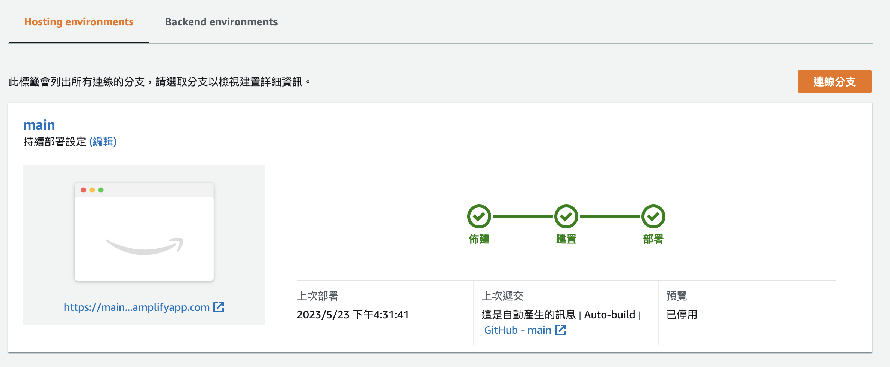
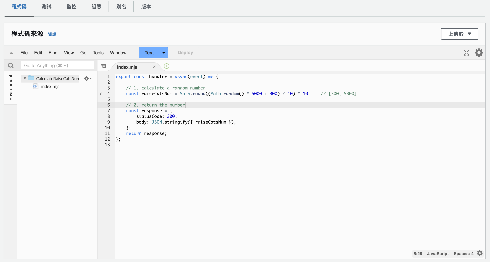
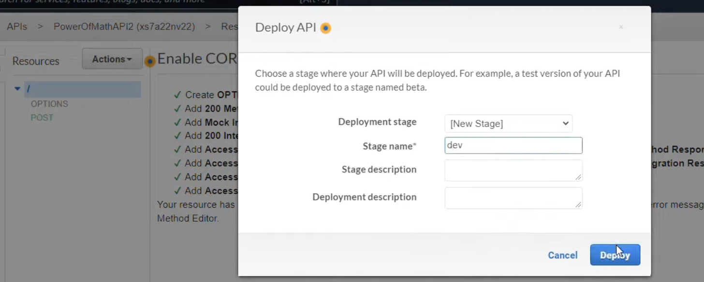
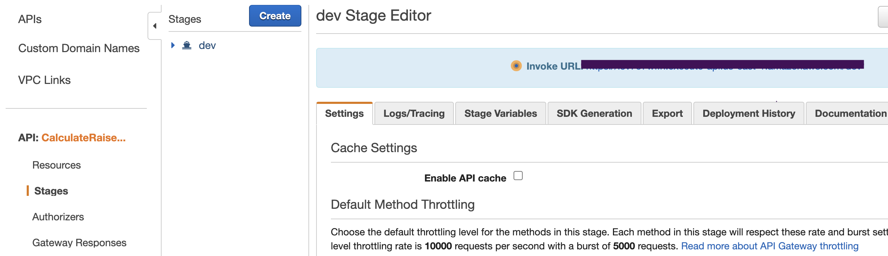
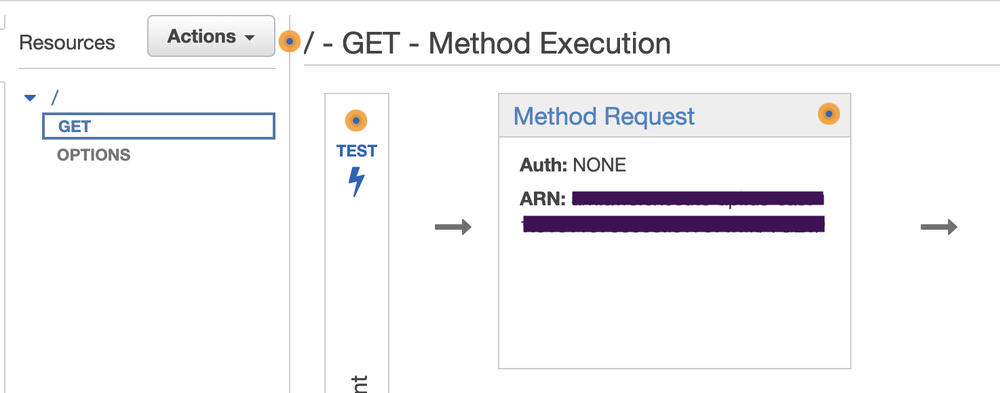
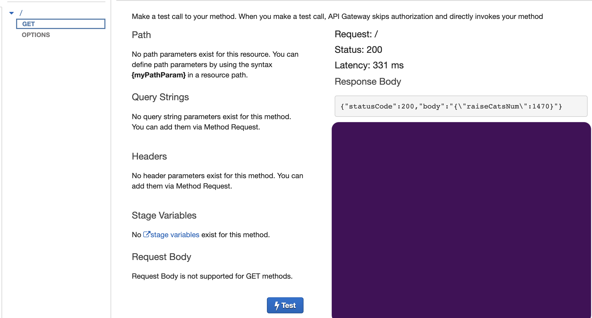

# First AWS

## AWS Tools

1. amplify
2. Lambda
3. API Gateway

## Steps

### Amplify -- client side website

1. Write a simple website by using html, css, or js framework.
2. Go to **Amplify** -> App **Hosting** -> Github (or use .zip upload, ... etc) -> grant any permission, keep any setting not changed, and keep clicking `yes, I agree` or something... until to the final step.
3. Then you will get a successful deployed website and it's domain url.
   

### Lambda -- backend function

1. Go to **lambda** -> create a function -> create a name for this function -> choose **Nodejs** at run-time field (since I use `.js` function, if you write `.py` then choose python 3.x) -> create.
2. In the function detail page, scroll down page to the editor field, and write down your code here. After finishing it, click **deploy** button.
   
3. Now let's test this function to check if it works as expected.
   - click the **arrow-down** button near the **Test** button -> configure function event
   - create an event name as anything you want
   - edit event body json to anything you want
   - click **save**
   - back to the editor page, click **test**, and you can see the repsonse from this function.

### API Gateway -- a trigger for lambda function

1. Go to **API Gateway** -> choose REST API (public) -> build
2. setting:
   - protocol: REST
   - new API: new API
   - settings: create any API name you want
   - click Create API button
3. In **Resources** field:
   - click `/` -> click **Actions** -> click **create method**, then choose HTTP method you want. (I choose `GET` here)
   - settings:
     - Integration type: lambda function
     - Use Lambda Proxy integration: false
     - Lambda function: choose the function you just created
     - click save
   - enable `cors` for the API gateway:
     - Since the website is deployed on amplify domain, and the lambda function is on different domain, we need `cors` for cross domain requesting
     - click GET/POST method -> Actions -> Enable CORS -> click Enable cors and replace ... -> Yes
   - deploy this API:
     - click GET/POST HTTP method -> Actions -> Deploy API -> choose new stage -> type `dev` -> deploy
       
   - Then it will show API URL for you, copy it.
     
   - Test this API:
     - go back to resources panel on the left hand side
     - click HTTP method GET/POST
     - click TEST button
       
     - If you use `POST` method, fill up the body field, else, just click **Test** button.
     - If the result shows 200 status code, it means you are succeed!
       

### (Optional) DynamoDB - noSQL database

1. Create table -> fill table name -> Partition key: ID (string) -> create
2. Go to DB dashboard -> general info -> Amazon resource name (ARN) -> copy it

// TODO: db

### Resource

- [Youtube video tutorial](https://www.youtube.com/watch?v=7m_q1ldzw0U)
